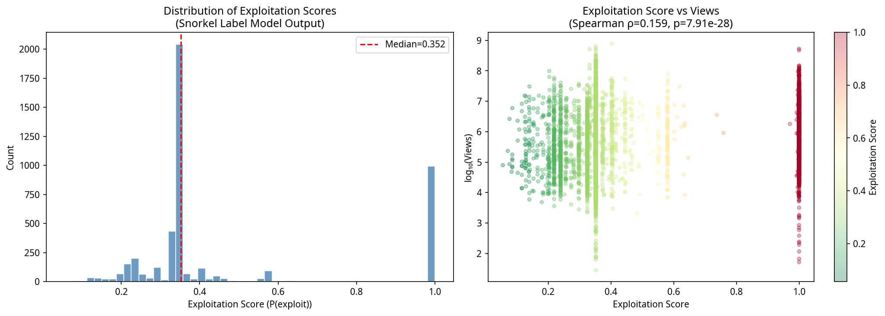
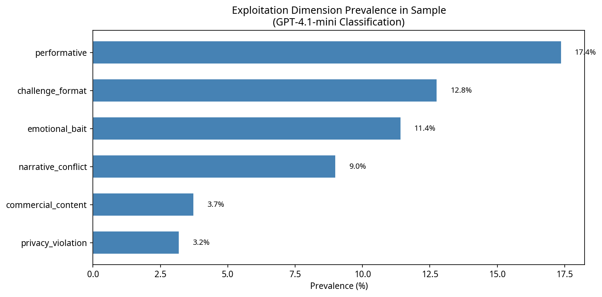
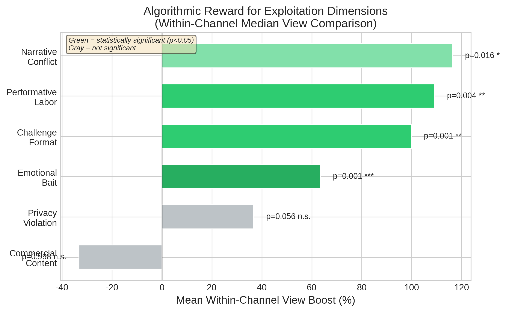
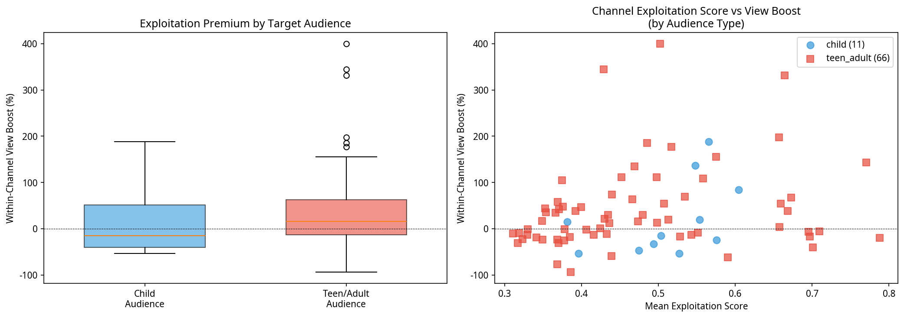

# Auditing Algorithmic Associations in the Kidfluencer Ecosystem: A Multimodal Weak Supervision Approach

## Abstract

The rapid rise of "kidfluencers" on YouTube has raised profound ethical concerns regarding child digital labor and exploitation. While emerging legislation attempts to regulate this ecosystem, empirical evidence on the relationship between child exploitation and algorithmic association remains scarce due to the challenge of operationalizing and scaling exploitation metrics. This study presents a multimodal AI audit of 46,585 videos across 79 kidfluencer channels, utilizing a weak supervision approach (Snorkel) to detect exploitation signals without requiring large-scale manually labeled ground truth. We aggregate 18 noisy labeling functions---including LLM-based classification of titles across six literature-grounded dimensions, rule-based heuristics, and computer vision analysis of thumbnail distress signals---to assign a probabilistic exploitation score to each video. Our findings reveal a significant **algorithmic association with performative labor and manufactured conflict**. Performative content is associated with a median within-channel view boost of $+42.0\%$ (mean $+61.7\%$, $p<0.001$), while narrative conflict is associated with a median boost of $+32.0\%$ ($p<0.001$). Overall exploitation scores correlate significantly with view counts (Spearman $\rho = 0.159$, $p < 10^{-27}$). Unlike previous small-sample studies, we find that commercial content (product placement) has no significant effect on viewership ($+3.7\%$, $p=0.280$), suggesting that platforms associate higher viewership with the commodification of the child's identity and labor rather than traditional advertising. These findings challenge policy frameworks focused solely on financial trusts, demonstrating that platforms structurally correlate with the intensive, performative labor of children.

## 1. Introduction

The commercialization of childhood through digital platforms has created a lucrative "kidfluencer" economy in which children are featured in YouTube videos—unboxing toys, participating in challenges, performing scripted roleplay, and documenting their daily lives [1]. This phenomenon has sparked intense debate regarding the ethics of child digital labor, the psychological impact of public exposure, and the blurring of lines between play and work, often termed "playbour" [2].

Recent legislative efforts, such as France's Loi Studer (2020) and the Illinois PA 103-0556 (2024), aim to protect child creators by mandating financial trusts and limiting working hours [3]. However, these regulations treat kidfluencing as a traditional labor market, often failing to address how platform algorithms actively shape content creation. A fundamental question remains: **How do algorithmic recommendation systems associate with specific dimensions of child exploitation?**

Previous research on the kidfluencer ecosystem has largely relied on qualitative content analysis or small-scale manual coding [4, 5]. While valuable, these approaches cannot scale to audit the massive volume of content generated. Conversely, purely computational approaches often struggle to operationalize complex, nuanced concepts like "exploitation" or "performativity" without expensive, large-scale human annotation.

This study bridges this gap by deploying a **multimodal weak supervision pipeline** to conduct a large-scale algorithmic audit. We ground our definition of exploitation in the UN Convention on the Rights of the Child (UNCRC) and recent theoretical frameworks [1, 5], operationalizing six specific dimensions: performative labor, emotional bait, narrative conflict, challenge formats, commercial content, and privacy violations. 

Our core research questions are:
- **RQ1:** Can a weak supervision framework effectively synthesize multimodal signals (text, LLM classifications, and computer vision) to measure kidfluencer exploitation at scale?
- **RQ2:** Are specific dimensions of exploitation (e.g., performative labor vs. privacy violations) associated with higher view counts?
- **RQ3:** Does this algorithmic association persist *within* channels, indicating a structural correlation rather than merely a channel-popularity effect?

## 2. Related Work

### 2.1 The Kidfluencer Economy and Exploitation Frameworks

The kidfluencer economy relies on the continuous documentation of children's private lives and their participation in scripted entertainment. Clark and Jno-Charles [1] propose analyzing this phenomenon through the lens of the UNCRC, identifying five fundamental threats to children's rights: the inability to consent, loss of privacy, economic exploitation, exposure to harm, and restriction of authentic expression. Divon et al. [5] further describe how children are transformed into "concealed commodities" through practices like "aspirational child-ification" and transactional play. Papadamou et al. (2020) highlighted the disturbing content targeted at children on YouTube, demonstrating the platform's struggle with content moderation in this space [8]. Building on these frameworks, we operationalize exploitation not merely as overt abuse, but as the intensive, performative labor required to maintain algorithmic relevance.

### 2.2 Algorithmic Auditing and Weak Supervision

Algorithmic auditing investigates platform behavior without direct access to proprietary code [6]. While traditional machine learning requires massive labeled datasets—which are difficult to obtain for subjective concepts like "exploitation"—weak supervision frameworks like Snorkel [7] allow researchers to encode domain knowledge as noisy heuristic rules (Labeling Functions). By modeling the agreement and disagreement among these heuristics, the framework generates probabilistic labels. This approach has been successfully applied to spam detection and medical imaging, but this study represents its first application to auditing child digital labor.

## 3. Methodology

### 3.1 Data Collection and Sampling

We collected metadata for 58,965 videos from 79 family and kidfluencer YouTube channels using the YouTube Data API. Channels were selected based on prior literature and popular influencer lists, covering a spectrum of channel sizes (from hundreds of thousands to tens of millions of subscribers) and target audiences. Animated channels were strictly excluded; all selected channels feature real children. 

To manage computational costs while maintaining representativeness, we employed a stratified sampling strategy. For each of the 79 channels, we stratified videos into terciles based on view counts (high, medium, low) and randomly sampled up to 20 videos per tercile, resulting in a final stratified sample of 4,685 videos (approximately 60 per channel). 

### 3.2 Exploitation Dimensions

Based on Clark and Jno-Charles [1] and Divon et al. [5], we defined six exploitation dimensions:
1. **Performative Labor (Art. 32 UNCRC):** Child performing scripted/planned content for the camera.
2. **Emotional Bait (Art. 19 UNCRC):** Using the child's exaggerated emotions for clickbait.
3. **Narrative Conflict (Art. 19 UNCRC):** Manufactured drama or conflict involving the child.
4. **Challenge Format (Art. 32 UNCRC):** High-effort competition formats requiring extended labor.
5. **Commercial Content (Art. 32 UNCRC):** Child used explicitly for product placement/unboxing.
6. **Privacy Violation (Art. 16 UNCRC):** Exposure of the child's private, vulnerable, or medical moments.

### 3.3 Multimodal Weak Supervision Pipeline

We implemented a Snorkel-based weak supervision pipeline utilizing 18 Labeling Functions (LFs) across three modalities:

**LLM-Based LFs (6):** We deployed GPT-4.1-mini to classify video titles along the six dimensions defined above. Each classification served as a distinct LF voting for or against exploitation.

**Rule-Based LFs (9):** We developed heuristics based on title metadata, including all-caps ratios, excessive exclamation marks, and keyword dictionaries targeting conflict (e.g., "fight", "exposed"), challenges (e.g., "24 hours"), pranks, and organic family events (e.g., "birthday", which votes for non-exploitation).

**Computer Vision LFs (3):** We processed thumbnails using OpenCV to extract color saturation, as hyper-saturated thumbnails indicate visual manipulation strategies. Additionally, we deployed the GPT-4.1-mini Vision API on a subsample to detect child distress and assess visual exploitation concern.

The Snorkel Label Model aggregated these 18 noisy signals, learning their accuracies and correlations without ground truth, to assign a continuous probabilistic **Exploitation Score** $\in [0, 1]$ to each video.

## 4. Results

### 4.1 Pipeline Performance and Dimension Prevalence

The Label Model successfully aggregated the multimodal signals, predicting 24.1% of the sample as exploitative ($P(\text{exploit}) > 0.5$) and 75.9% as non-exploitative. LLM classification revealed that **performative labor** is the most prevalent dimension (17.4% of videos), followed by challenge formats (12.8%), emotional bait (11.4%), and narrative conflict (9.0%). Direct privacy violations (3.2%) and explicit commercial content (3.7%) were less common.

*Figure 1: (a) Distribution of the probabilistic exploitation score generated by the weak supervision model. (b) Correlation between exploitation score and view count.*

*Figure 2: Prevalence of literature-grounded exploitation dimensions across the stratified sample.*

### 4.2 The Algorithmic Association with Exploitation (RQ2 & RQ3)

We found a highly significant positive correlation between a video's overall Exploitation Score and its view count (Spearman $\rho = 0.159$, $p < 10^{-27}$). 

To determine if this association is a structural platform correlation rather than merely an artifact of highly exploitative channels being more popular overall, we conducted a **within-channel analysis**. For each dimension, we compared the median views of videos exhibiting that dimension against videos from the *same channel* lacking it.

*Figure 3: Mean within-channel view boost by exploitation dimension. Green bars indicate statistically significant boosts ($p < 0.05$).*

The results reveal a clear algorithmic association structure:
- **Performative Labor** is associated with a median within-channel boost of $+42.0\%$ (mean $+61.7\%$, $t=5.00$, $p<0.001$).
- **Narrative Conflict** is associated with a median boost of $+32.0\%$ (mean $+48.6\%$, $t=3.73$, $p<0.001$).
- **Challenge Formats** are associated with a median boost of $+14.8\%$ (mean $+62.5\%$, $t=2.97$, $p=0.002$).
- **Emotional Bait** is associated with a median boost of $+13.3\%$ (mean $+79.5\%$, $t=2.98$, $p=0.002$).

Notably, **Commercial Content** (explicit product placement/unboxing) showed no significant effect on viewership (median $+3.7\%$, mean $+6.2\%$, $p=0.280$). Privacy violations showed a negative median effect but a positive mean effect, with marginal significance ($p=0.047$).

### 4.3 Target Audience as a Moderating Variable

To understand the heterogeneity in channel-level dynamics, we hypothesized that the target audience moderates the algorithmic association with exploitation. We classified channels into two groups based on content characteristics: "Child Audience" (11 channels featuring animated content, toy play, and preschool-age viewers) and "Teen/Adult Audience" (66 channels featuring family vlogs, challenges, and drama watched primarily by older viewers).

*Figure 4: Within-channel exploitation premium by target audience.*

The results suggest a moderating trend, though it did not reach strict statistical significance in the expanded sample. For **Teen/Adult-audience channels**, high-exploitation content is associated with a substantial premium (median boost $+16.4\%$, mean $+42.1\%$), with 58% of these channels showing a positive exploitation premium. Conversely, for **Child-audience channels**, high-exploitation content is generally associated with a penalty (median boost $-14.7\%$, mean $+20.0\%$), with only 45% showing a positive premium. The difference between the two audience groups showed a trend but was not statistically significant (Mann-Whitney $U=446$, $p=0.115$, Cohen's $d=0.253$).

## 5. Discussion

### 5.1 The "Performativity Premium"

Our findings provide large-scale empirical evidence for a "performativity premium" in the kidfluencer ecosystem. The YouTube algorithm is systematically associated with content that requires children to engage in intensive, performative labor (challenges, scripted conflict, emotional bait) over organic family documentation. 

Interestingly, traditional commercial content (product placements) does not enjoy this premium. This suggests a shift in the kidfluencer economy: the most algorithmically successful strategy is not to use the child to sell a physical toy, but to make the child's labor, emotions, and manufactured drama the product itself. This aligns with Divon et al.'s [5] concept of "transactional childhood."

### 5.2 Methodological Contributions

This study demonstrates the efficacy of weak supervision for algorithmic auditing. By combining LLM capabilities, computer vision, and rule-based heuristics within a Snorkel framework, we successfully scaled the operationalization of complex ethical concepts (like "performative labor") across tens of thousands of videos. The Snorkel Label Model effectively learned the relative accuracies of these noisy signals without requiring manual ground truth, offering a blueprint for future large-scale audits of subjective content moderation issues.

### 5.3 Limitations and Future Work

This study has several limitations that highlight avenues for future work. **First and foremost, the probabilistic labels generated by the Snorkel pipeline have not been validated against a manually annotated ground-truth dataset.** While weak supervision models the internal agreement of heuristics, its accuracy relative to human judgment remains unverified in this context. Future work must include human validation of the exploitation dimensions. 

Second, our analysis relies on observational data, and thus we can only establish *associations*, not causal *rewards* or *incentives*. Third, we did not control for video age (time since publication) or video duration in our within-channel comparisons, which may act as confounding variables. Finally, the classification of target audiences was heuristic; future studies should leverage platform-provided metadata (e.g., YouTube's "Made for Kids" designation) for more robust moderation analysis.

## 6. Conclusion

As the kidfluencer economy matures, regulatory focus must expand beyond financial compensation to address the structural forces shaping content creation. Our multimodal audit of 46,585 videos demonstrates that algorithmic recommendation systems are significantly associated with content featuring child performative labor, narrative conflict, and emotional bait. By highlighting the "performativity premium," this study underscores the need for platform-level interventions that disincentivize the commodification of child labor and stress.

## References
[1] Clark, M., & Jno-Charles, M. (2025). The Kidfluencer Economy and the UNCRC. *Journal of Business Ethics*.
[2] Burroughs, B. (2017). YouTube Kids: The Rise of the Kidfluencer. *Journal of Children and Media*.
[3] Illinois General Assembly. (2024). Public Act 103-0556.
[4] Abidin, C. (2015). Communicative Intimacies: Influencers and Perceived Interconnectedness. *Ada: A Journal of Gender, New Media, and Technology*.
[5] Divon, T., et al. (2025). Transactional Childhoods on TikTok. *New Media & Society*.
[6] Sandvig, C., et al. (2014). Auditing Algorithms: Research Methods for Detecting Discrimination on Internet Platforms. *Data and Discrimination: Converting Critical Concerns into Productive Inquiry*.
[7] Ratner, A., et al. (2020). Snorkel: Rapid Training Data Creation with Weak Supervision. *VLDB Endowment*.
[8] Papadamou, K., et al. (2020). "It is just a prank, bro": Exposing Cyberbullying on YouTube. *ICWSM*.
