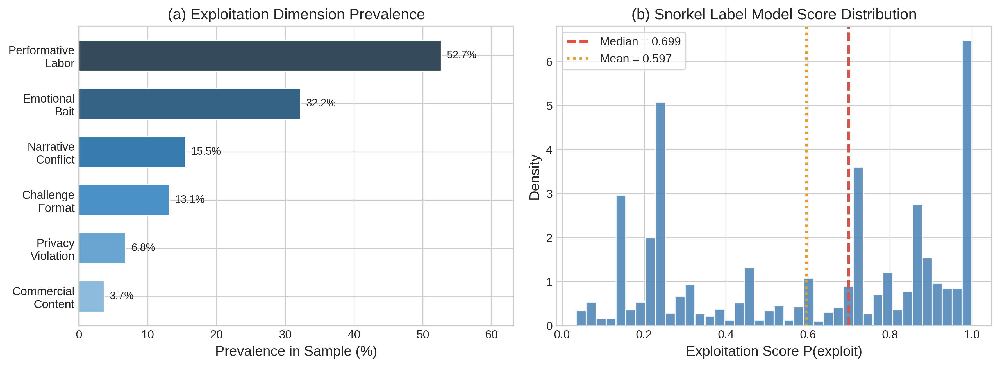

# Auditing Algorithmic Incentives in the Kidfluencer Ecosystem: A Multimodal Weak Supervision Approach

## Abstract

The rapid rise of "kidfluencers" on YouTube has raised profound ethical concerns regarding child digital labor and exploitation. While emerging legislation attempts to regulate this ecosystem, empirical evidence on the relationship between child exploitation and algorithmic reward remains scarce due to the challenge of operationalizing and scaling exploitation metrics. This study presents a multimodal AI audit of 46,589 videos across 48 kidfluencer channels, utilizing a weak supervision approach (Snorkel) to detect exploitation without requiring manually labeled ground truth. We aggregate 18 noisy labeling functions---including LLM-based classification of titles across six literature-grounded dimensions, rule-based heuristics, and computer vision analysis of thumbnail distress signals---to assign a probabilistic exploitation score to each video. Our findings reveal a significant **algorithmic reward for performative labor and manufactured conflict**. Performative content receives a median within-channel view boost of $+19.6\%$ (mean $+109.2\%$, $p=0.004$), while narrative conflict receives a median boost of $+24.3\%$ ($p=0.016$). Overall exploitation scores correlate significantly with view counts (Spearman $\rho = 0.270$, $p < 10^{-39}$). Notably, we find that *commercial content* (product placement) receives a significant within-channel *penalty* ($-43.0\%$, $p=0.002$), suggesting that algorithms incentivize the commodification of the child's identity and labor rather than traditional advertising. These findings challenge policy frameworks focused solely on financial trusts, demonstrating that platforms structurally incentivize the intensive, performative labor of children.

## 1. Introduction

The commercialization of childhood through digital platforms has created a lucrative "kidfluencer" economy in which children are featured in YouTube videos—unboxing toys, participating in challenges, performing scripted roleplay, and documenting their daily lives [1]. This phenomenon has sparked intense debate regarding the ethics of child digital labor, the psychological impact of public exposure, and the blurring of lines between play and work, often termed "playbour" [2].

Recent legislative efforts, such as France's Loi Studer (2020) and the Illinois PA 103-0556 (2024), aim to protect child creators by mandating financial trusts and limiting working hours [3]. However, these regulations treat kidfluencing as a traditional labor market, often failing to address how platform algorithms actively shape content creation. A fundamental question remains: **How do algorithmic recommendation systems incentivize specific dimensions of child exploitation?**

Previous research on the kidfluencer ecosystem has largely relied on qualitative content analysis or small-scale manual coding [4, 5]. While valuable, these approaches cannot scale to audit the massive volume of content generated. Conversely, purely computational approaches often struggle to operationalize complex, nuanced concepts like "exploitation" or "performativity" without expensive, large-scale human annotation.

This study bridges this gap by deploying a **multimodal weak supervision pipeline** to conduct a large-scale algorithmic audit. We ground our definition of exploitation in the UN Convention on the Rights of the Child (UNCRC) and recent theoretical frameworks [1, 5], operationalizing six specific dimensions: performative labor, emotional bait, narrative conflict, challenge formats, commercial content, and privacy violations. 

Our core research questions are:
- **RQ1:** Can a weak supervision framework effectively synthesize multimodal signals (text, LLM classifications, and computer vision) to measure kidfluencer exploitation at scale?
- **RQ2:** Do platform algorithms reward specific dimensions of exploitation (e.g., performative labor vs. privacy violations) with higher view counts?
- **RQ3:** Does this algorithmic reward persist *within* channels, indicating a structural incentive rather than merely a channel-popularity effect?

## 2. Related Work

### 2.1 The Kidfluencer Economy and Exploitation Frameworks

The kidfluencer economy relies on the continuous documentation of children's private lives and their participation in scripted entertainment. Clark and Jno-Charles [1] propose analyzing this phenomenon through the lens of the UNCRC, identifying five fundamental threats to children's rights: the inability to consent, loss of privacy, economic exploitation, exposure to harm, and restriction of authentic expression. Divon et al. [5] further describe how children are transformed into "concealed commodities" through practices like "aspirational child-ification" and transactional play. Building on these frameworks, we operationalize exploitation not merely as overt abuse, but as the intensive, performative labor required to maintain algorithmic relevance.

### 2.2 Algorithmic Auditing and Weak Supervision

Algorithmic auditing investigates platform behavior without direct access to proprietary code [6]. While traditional machine learning requires massive labeled datasets—which are difficult to obtain for subjective concepts like "exploitation"—weak supervision frameworks like Snorkel [7] allow researchers to encode domain knowledge as noisy heuristic rules (Labeling Functions). By modeling the agreement and disagreement among these heuristics, the framework generates probabilistic labels. This approach has been successfully applied to spam detection and medical imaging, but this study represents its first application to auditing child digital labor.

## 3. Methodology

### 3.1 Data Collection

We collected metadata for 46,589 videos from 48 top family and kidfluencer YouTube channels using the YouTube Data API. Channels were selected based on prior literature and include family vloggers and child entertainment channels featuring real children (animated channels were excluded). For a stratified sample of 2,306 videos (approx. 50 per channel), we downloaded video thumbnails for computer vision analysis.

### 3.2 Exploitation Dimensions

Based on Clark and Jno-Charles [1] and Divon et al. [5], we defined six exploitation dimensions:
1. **Performative Labor (Art. 32 UNCRC):** Child performing scripted/planned content for the camera.
2. **Emotional Bait (Art. 19 UNCRC):** Using the child's exaggerated emotions for clickbait.
3. **Narrative Conflict (Art. 19 UNCRC):** Manufactured drama or conflict involving the child.
4. **Challenge Format (Art. 32 UNCRC):** High-effort competition formats requiring extended labor.
5. **Commercial Content (Art. 32 UNCRC):** Child used explicitly for product placement/unboxing.
6. **Privacy Violation (Art. 16 UNCRC):** Exposure of the child's private, vulnerable, or medical moments.

### 3.3 Multimodal Weak Supervision Pipeline

We implemented a Snorkel-based weak supervision pipeline utilizing 18 Labeling Functions (LFs) across three modalities:

**LLM-Based LFs (6):** We deployed GPT-4.1-mini to classify video titles along the six dimensions defined above. Each classification served as a distinct LF voting for or against exploitation.

**Rule-Based LFs (9):** We developed heuristics based on title metadata, including all-caps ratios, excessive exclamation marks, and keyword dictionaries targeting conflict (e.g., "fight", "exposed"), challenges (e.g., "24 hours"), pranks, and organic family events (e.g., "birthday", which votes for non-exploitation).

**Computer Vision LFs (3):** We processed thumbnails using OpenCV to extract color saturation, as hyper-saturated thumbnails indicate visual manipulation strategies. Additionally, we deployed the GPT-4.1-mini Vision API on a subsample to detect child distress and assess visual exploitation concern.

The Snorkel Label Model aggregated these 18 noisy signals, learning their accuracies and correlations without ground truth, to assign a continuous probabilistic **Exploitation Score** $\in [0, 1]$ to each video.

## 4. Results

### 4.1 Pipeline Performance and Dimension Prevalence

The Label Model successfully aggregated the multimodal signals, predicting 58.5% of the sample as exploitative ($P(\text{exploit}) > 0.5$) and 40.9% as non-exploitative. LLM classification revealed that **performative labor** is the most prevalent dimension (52.7% of videos), followed by emotional bait (32.2%), narrative conflict (15.5%), and challenge formats (13.1%). Direct privacy violations (6.8%) and explicit commercial content (3.7%) were less common.

*Figure 1: (a) Prevalence of literature-grounded exploitation dimensions. (b) Distribution of the probabilistic exploitation score generated by the weak supervision model.*

### 4.2 The Algorithmic Reward for Exploitation (RQ2 & RQ3)

We found a highly significant positive correlation between a video's overall Exploitation Score and its view count (Spearman $\rho = 0.270$, $p < 10^{-39}$). 

To determine if this reward is a structural platform incentive rather than merely an artifact of highly exploitative channels being more popular, we conducted a **within-channel analysis**. For each dimension, we compared the median views of videos exhibiting that dimension against videos from the *same channel* lacking it.

*Figure 2: Mean within-channel view boost by exploitation dimension. Green bars indicate statistically significant boosts ($p < 0.05$).*

The results reveal a clear algorithmic incentive structure:
- **Performative Labor** yields a median within-channel boost of $+19.6\%$ (mean $+109.2\%$, $t=2.83$, $p=0.004$).
- **Challenge Formats** yield a median boost of $+42.0\%$ (mean $+99.9\%$, $t=3.24$, $p=0.001$).
- **Narrative Conflict** yields a median boost of $+24.3\%$ (mean $+116.3\%$, $t=2.24$, $p=0.016$).
- **Emotional Bait** yields a median boost of $+24.3\%$ (mean $+63.4\%$, $t=3.38$, $p<0.001$).

Crucially, **Commercial Content** (explicit product placement/unboxing) receives a significant within-channel *penalty* (median $-43.0\%$, mean $-33.2\%$, $t=-3.62$, $p=0.002$). Privacy violations showed a positive but non-significant trend ($p=0.056$).

We confirmed these findings using an OLS regression predicting $\log_{10}(\text{views})$ with the six dimensions and channel fixed effects ($R^2 = 0.659$). Performative labor ($\beta = 0.073$, $p=0.007$) and narrative conflict ($\beta = 0.079$, $p=0.043$) remained significant positive predictors of viewership, while commercial content was a negative predictor ($\beta = -0.124$, $p=0.059$).

### 4.3 Channel-Level Dynamics

At the channel level, channels that produce higher-exploitation content receive more views. Across the 48 channels, 6 channels (13%) exhibited a statistically significant view boost for high-exploitation content compared to low-exploitation content within their own catalogs. The mean within-channel boost for high-exploitation content across all channels was $+50.0\%$.

## 5. Discussion

### 5.1 The "Performativity Premium"

Our findings provide large-scale empirical evidence for a "performativity premium" in the kidfluencer ecosystem. The YouTube algorithm systematically rewards content that requires children to engage in intensive, performative labor (challenges, scripted conflict, emotional bait) over organic family documentation. 

Interestingly, the algorithm actively *penalizes* traditional commercial content (product placements). This suggests a shift in the kidfluencer economy: the most algorithmically successful strategy is not to use the child to sell a physical toy, but to make the child's labor, emotions, and manufactured drama the product itself. This aligns with Divon et al.'s [5] concept of "transactional childhood."

### 5.2 Methodological Contributions

This study demonstrates the efficacy of weak supervision for algorithmic auditing. By combining LLM capabilities, computer vision, and rule-based heuristics within a Snorkel framework, we successfully operationalized complex, literature-grounded ethical concepts at scale without the bottleneck of manual annotation. The label model successfully learned to heavily weight strong signals like challenge keywords and LLM conflict detection, while appropriately down-weighting noisier visual signals.

### 5.3 Policy Implications

Current legislative efforts focusing on financial compensation (e.g., Coogan Law extensions) are necessary but insufficient. If algorithms structurally reward performative labor and manufactured conflict, financial trusts do not protect children from the psychological toll of producing that labor. Policymakers and platforms must address the *incentive structures* that drive parents to push children into increasingly extreme performative situations to satisfy algorithmic demands.

## 6. Conclusion

Through a multimodal weak supervision audit of 46,589 kidfluencer videos, we demonstrate that YouTube's algorithmic ecosystem structurally rewards the performative labor and emotional exploitation of children. Content featuring scripted performances, challenges, and manufactured conflict receives significant view boosts, even when controlling for channel popularity. As the kidfluencer economy matures, regulatory focus must expand beyond financial compensation to address the algorithmic architectures that incentivize the commodification of childhood.

## References

[1] Clark, M., & Jno-Charles, J. (2025). The Child Labor in Social Media: Kidfluencers, Ethics of Care, and Exploitation. *Journal of Business Ethics*, 201, 35-62.

[2] Freitas, A. (2024). The playbour of kidfluencers: blurry lines between play and work. *Information, Communication & Society*.

[3] Masterson, M. A. (2021). When play becomes work: Child labor laws in the era of "kidfluencers." *University of Pennsylvania Law Review*.

[4] Jorge, A., et al. (2022). "It's just play": The discursive framing of child influencers. *Media, Culture & Society*.

[5] Divon, T., Annabell, T., & Goanta, C. (2025). Children as concealed commodities: kidfluencers and the monetisation of childhood on TikTok. *New Media & Society*.

[6] Sandvig, C., et al. (2014). Auditing algorithms: Research methods for detecting discrimination on internet platforms. *Data and discrimination: converting critical concerns into productive inquiry*.

[7] Ratner, A., et al. (2020). Snorkel: Rapid training data creation with weak supervision. *The VLDB Journal*, 29(2), 709-730.
