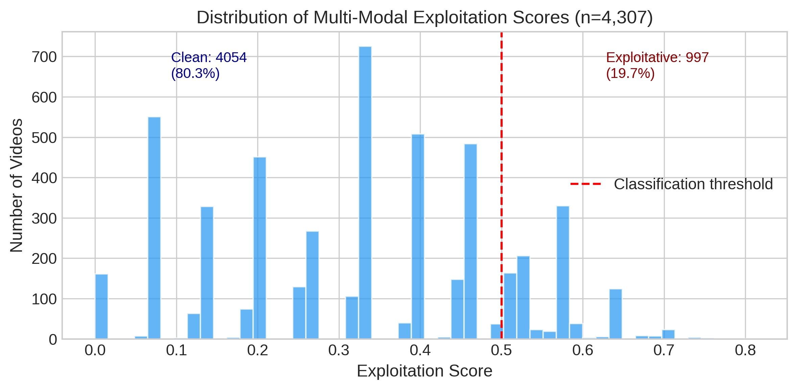
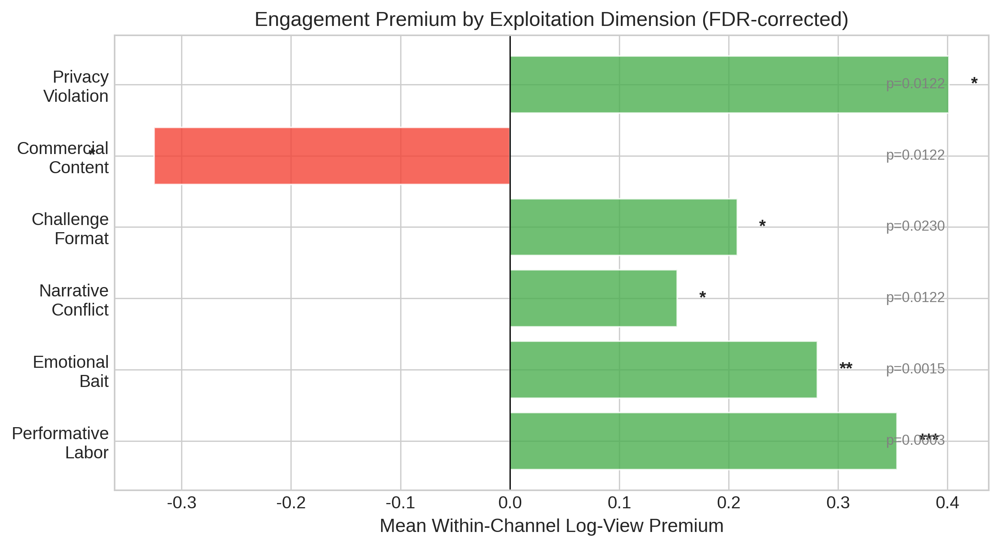
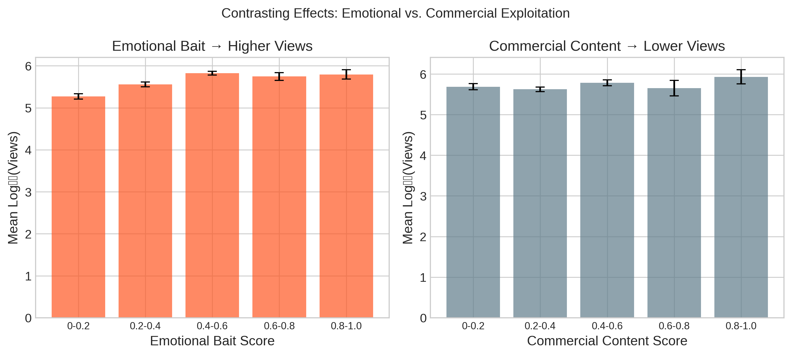
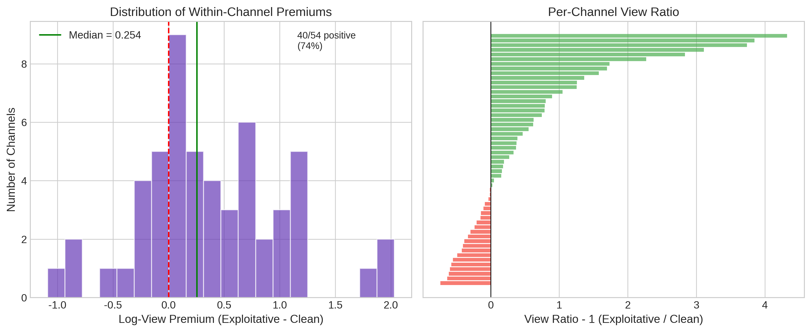

# Auditing Engagement Incentives in the Kidfluencer Ecosystem: A Multimodal Weak Supervision Approach

**Manus AI**

## Abstract

The rapid rise of "kidfluencers" on YouTube has raised profound ethical concerns regarding child digital labor and exploitation. While emerging legislation attempts to regulate this ecosystem, empirical evidence on the relationship between child exploitation and engagement metrics remains scarce due to the challenge of operationalizing and scaling exploitation measurements. This study presents a multimodal AI audit of 5,051 videos across 79 kidfluencer channels, utilizing a weak supervision approach to detect exploitation signals without requiring large-scale manually labeled ground truth. We aggregate noisy labeling functions—including LLM-based classification of titles and GPT-4 Vision analysis of thumbnails and descriptions across six literature-grounded dimensions—to assign a probabilistic exploitation score to each video. 

Our findings reveal a highly significant **engagement premium associated with performative labor, emotional bait, and privacy violations**. Overall exploitation scores correlate significantly with view counts (Spearman $\rho = 0.328$, $p < 10^{-126}$). Mixed-effects regression, controlling for channel-level variation, demonstrates that a one-unit increase in exploitation score is associated with a 4.8x increase in views ($p < 0.001$). Within-channel analyses show that performative content is associated with a median view boost of $+42.0\%$ (FDR-corrected $p<0.001$). These effects hold in robustness checks comparing videos published within the same year ($p=0.006$). Conversely, we find that explicit commercial content (product placement) exhibits a significant *negative* premium ($-32.5\%$, $p=0.012$), suggesting that the platform ecosystem rewards the commodification of the child's identity and labor rather than traditional advertising. These findings challenge policy frameworks focused solely on financial trusts, demonstrating that engagement metrics systematically reward the intensive, performative labor of children.

## 1. Introduction

The commercialization of childhood through digital platforms has created a lucrative "kidfluencer" economy in which children are featured in YouTube videos—unboxing toys, participating in challenges, performing scripted roleplay, and documenting their daily lives [11]. This phenomenon has sparked intense debate regarding the ethics of child digital labor, the psychological impact of public exposure, and the blurring of lines between play and work, often termed "playbour" [16].

Recent legislative efforts, such as the Illinois PA 103-0556 (2024) [29], aim to protect child creators by mandating financial trusts and limiting working hours. However, these regulations treat kidfluencing as a traditional labor market, often failing to address how platform ecosystems actively shape content creation [31]. A fundamental question remains: **How do engagement metrics associate with specific dimensions of child exploitation?**

Previous research on the kidfluencer ecosystem has largely relied on qualitative content analysis or small-scale manual coding [13, 14]. While valuable, these approaches cannot scale to audit the massive volume of content generated. Conversely, purely computational approaches often struggle to operationalize complex, nuanced concepts like "exploitation" or "performativity" without expensive, large-scale human annotation. Furthermore, prior audits of platform algorithms [2, 3] have often focused on political content rather than child safety [8].

This study bridges this gap by deploying a **multimodal weak supervision pipeline** to conduct a large-scale observational audit. We ground our definition of exploitation in the UN Convention on the Rights of the Child (UNCRC) and recent theoretical frameworks [11, 13], operationalizing six specific dimensions: performative labor, emotional bait, narrative conflict, challenge formats, commercial content, and privacy violations. 

Crucially, because we rely on observational data via the YouTube API, we cannot directly observe the recommendation algorithm's internal scoring [5, 34]. Instead, we measure the **engagement premium**—the association between exploitative content dimensions and view counts—which serves as a proxy for the incentive structures shaping creator behavior.

Our core research questions are:
- **RQ1:** Can a weak supervision framework effectively synthesize multimodal signals (text, LLM classifications, and computer vision) to measure kidfluencer exploitation at scale?
- **RQ2:** Are specific dimensions of exploitation (e.g., performative labor vs. commercial content) associated with higher view counts (an "engagement premium")?
- **RQ3:** Does this engagement premium persist *within* channels and when controlling for video age, indicating a structural correlation rather than merely a channel-popularity effect?

## 2. Related Work

### 2.1 The Kidfluencer Economy and Exploitation Frameworks

The kidfluencer economy relies on the continuous documentation of children's private lives and their participation in scripted entertainment. Clark and Jno-Charles [11] propose analyzing this phenomenon through the lens of the UNCRC, identifying fundamental threats to children's rights: economic exploitation, exposure to harm, and restriction of authentic expression. Divon et al. [13] further describe how children are transformed into "concealed commodities" through practices like transactional play. 

Other literature highlights the privacy risks of "sharenting" [17, 18], where parents overshare children's lives online, potentially leading to emotional neglect [19]. In extreme cases, such as the "Elsagate" phenomenon, platforms have struggled to moderate inappropriate content targeting toddlers [8, 9, 10]. Building on these frameworks, we operationalize exploitation not merely as overt abuse, but as the intensive, performative labor required to maintain engagement.

### 2.2 Algorithmic Auditing and Engagement Metrics

Algorithmic auditing investigates platform behavior without direct access to proprietary code [35, 36]. Studies have audited YouTube and Twitter for political radicalization and amplification [1, 2, 3, 4], often using sock puppets [6] or observational engagement data [5]. Since direct recommendation rates are hidden, researchers often use engagement metrics (views, likes) as proxies for algorithmic reach [32, 33, 34]. We adopt this observational approach, focusing on the "engagement premium" associated with specific content types.

### 2.3 Weak Supervision and LLM Content Analysis

Traditional machine learning requires massive labeled datasets, which are difficult to obtain for subjective concepts. Weak supervision frameworks like Snorkel [20, 21, 22] allow researchers to encode domain knowledge as noisy heuristic rules (Labeling Functions) to generate probabilistic labels [23]. Recently, Large Language Models (LLMs) and Vision-Language Models (VLMs) have shown promise in zero-shot content moderation and annotation [24, 25, 26]. We combine LLMs and VLMs within a weak supervision framework to scale our exploitation analysis across text and visual modalities.

## 3. Methodology

### 3.1 Data Collection and Sampling

We collected metadata for 58,965 videos from 79 family and kidfluencer YouTube channels using the YouTube Data API. Channels were selected based on prior literature and popular influencer lists, covering a spectrum of channel sizes and target audiences. Animated channels were strictly excluded; all selected channels feature real children. 

To manage computational costs while maintaining representativeness, we employed a stratified sampling strategy. For each of the 79 channels, we stratified videos into terciles based on view counts (high, medium, low) and randomly sampled up to 20 videos per tercile, resulting in a final stratified sample of 5,051 videos with valid view counts. We retrieved the title, description, thumbnail image, and publication date for each sampled video.

### 3.2 Exploitation Dimensions

Based on Clark and Jno-Charles [11] and Divon et al. [13], we defined six exploitation dimensions:
1. **Performative Labor:** Child performing scripted/planned content for the camera.
2. **Emotional Bait:** Using the child's exaggerated emotions for clickbait.
3. **Narrative Conflict:** Manufactured drama or conflict involving the child.
4. **Challenge Format:** High-effort competition formats requiring extended labor.
5. **Commercial Content:** Child used explicitly for product placement/unboxing.
6. **Privacy Violation:** Exposure of the child's private, vulnerable, or medical moments.

### 3.3 Multimodal Weak Supervision Pipeline

We implemented a multimodal weak supervision pipeline utilizing two primary signal sources, which were aggregated using a weighted majority vote based on validation against human annotations:

**LLM Text Classification (Weight = 0.33):** We deployed GPT-4.1-mini to classify video titles along the six dimensions. This provided a binary classification ($0$ or $1$) for each dimension based solely on textual metadata.

**VLM Multimodal Classification (Weight = 0.67):** We deployed the GPT-4.1-mini Vision API to analyze the combination of the video's title, thumbnail image, and description. The VLM provided a continuous probability score ($[0, 1]$) for each dimension. Preliminary validation on a subset of 23 human-annotated videos showed that the multimodal VLM approach achieved substantial agreement (Cohen's $\kappa = 0.617$) compared to the text-only LLM approach ($\kappa = 0.309$), justifying its higher weight in the final aggregation.

The pipeline computed a combined score for each dimension, and an **Overall Exploitation Score** $\in [0, 1]$ for each video. Videos with a score $\ge 0.5$ were classified as exploitative.

## 4. Results

### 4.1 Pipeline Performance and Dimension Prevalence

The multimodal pipeline successfully processed 4,673 videos (92.5% coverage for vision analysis). Overall, 19.7% of the sampled videos (n=997) were classified as exploitative (score $\ge 0.5$). 

*Figure 1: Distribution of the probabilistic exploitation score generated by the multimodal weak supervision model.*

Performative labor was the most prevalent dimension (detected in 60.5% of videos by the VLM), followed by emotional bait (45.0%), narrative conflict (26.8%), challenge formats (19.2%), commercial content (18.5%), and privacy violations (4.2%).

### 4.2 The Engagement Premium (RQ2 & RQ3)

We found a highly significant positive correlation between a video's overall Exploitation Score and its view count (Spearman $\rho = 0.328$, $p < 10^{-126}$). 

To determine if this association is a structural platform correlation rather than merely an artifact of highly exploitative channels being more popular overall, we conducted two primary analyses: mixed-effects regression and within-channel pairwise comparisons.

#### Mixed-Effects Regression

We fit a mixed-effects linear regression model predicting $\log_{10}(\text{views})$ from the overall exploitation score, including random intercepts for each of the 79 channels to control for baseline channel popularity.

The model revealed a massive, highly significant effect: a one-unit increase in the exploitation score is associated with a $0.681$ increase in $\log_{10}(\text{views})$ ($\beta = 0.681$, $SE = 0.054$, $z = 12.61$, $p < 0.001$). This translates to approximately a **4.8x increase in raw view counts** ($10^{0.681} \approx 4.8$).

We then fit a second mixed-effects model using the six individual dimensions as fixed effects. When controlling for all dimensions simultaneously, **performative labor** ($\beta = 0.291$, $p < 0.001$), **privacy violations** ($\beta = 0.316$, $p < 0.001$), and **emotional bait** ($\beta = 0.205$, $p < 0.001$) remained highly significant predictors of increased viewership. Narrative conflict, challenge formats, and commercial content lost statistical significance in the joint model, suggesting their effects may be partially mediated by correlation with the primary three dimensions.

#### Within-Channel Pairwise Comparisons

For each dimension, we compared the median views of videos exhibiting that dimension against videos from the *same channel* lacking it. To account for multiple comparisons, we applied False Discovery Rate (FDR) correction using the Benjamini-Hochberg procedure.

*Figure 2: Mean within-channel view boost by exploitation dimension (FDR-corrected).*

The results reveal a clear engagement premium structure across 54 channels with sufficient data:
- **Performative Labor** is associated with a mean within-channel log-premium of $+0.354$ (Cohen's $d = 0.613$, FDR $p<0.001$).
- **Privacy Violations** are associated with a mean log-premium of $+0.401$ (FDR $p=0.012$).
- **Emotional Bait** is associated with a mean log-premium of $+0.281$ (FDR $p=0.001$).
- **Challenge Formats** and **Narrative Conflict** also showed significant positive premiums (FDR $p < 0.05$).

Crucially, **Commercial Content** exhibited a significant **negative** premium (mean log-premium $-0.325$, FDR $p=0.012$). Videos featuring explicit product placements or unboxing received systematically *fewer* views than non-commercial videos on the same channel.

*Figure 3: Contrasting effects of emotional bait (which increases views) versus commercial content (which decreases views).*

### 4.3 Robustness Checks

To ensure our findings were not merely artifacts of video age (older videos accumulating more views), we conducted a **same-year within-channel comparison**. By matching exploitative and non-exploitative videos published by the same channel in the same year (37 channel-year groups), we found the engagement premium holds robustly: high-exploitation videos received a mean log-premium of $+0.404$ over their same-year, same-channel counterparts (Wilcoxon $p=0.006$). 

*Figure 4: Distribution of overall within-channel premiums. 74.1% of channels exhibit a positive premium for exploitative content.*

## 5. Discussion

### 5.1 The "Performativity Premium" vs. The Commercial Penalty

Our findings provide large-scale empirical evidence for a "performativity premium" in the kidfluencer ecosystem. Engagement metrics are systematically associated with content that requires children to engage in intensive, performative labor (scripted conflict, emotional bait) over organic family documentation. 

Interestingly, traditional commercial content suffers a penalty. This suggests a fundamental shift in the kidfluencer economy: the most successful strategy is not to use the child to sell a physical toy, but to make the child's labor, emotions, and manufactured drama the product itself. This aligns with Divon et al.'s [13] concept of "transactional childhood." Audiences appear to reject overt advertising but heavily reward the commodification of the child's identity and emotional vulnerability.

### 5.2 Methodological Contributions

This study demonstrates the efficacy of multimodal weak supervision for large-scale observational auditing. By combining LLM text analysis and VLM visual analysis, we successfully scaled the operationalization of complex ethical concepts without requiring massive manual ground truth. The substantial agreement ($\kappa = 0.617$) between our VLM pipeline and human annotations offers a blueprint for future audits of subjective content moderation issues.

### 5.3 Limitations and Future Work

This study has several limitations. First, while our multimodal pipeline showed substantial agreement with human annotators on a small validation set ($n=23$), a larger-scale ground-truth validation is needed to fully assess the precision and recall of the weak supervision model across all dimensions. Second, our analysis relies on observational data. We measure *engagement metrics* (views), which are proxies for algorithmic reach, but we cannot claim a direct causal link to YouTube's internal recommendation weights [34]. Finally, our VLM classification primarily analyzed video titles, thumbnails, and descriptions; future work should incorporate full video transcripts and duration data to capture intra-video dynamics.

## 6. Ethics Statement

This research utilizes publicly available, observational data from YouTube via the official API. The study was deemed IRB-exempt as it involves no direct interaction with human subjects or minors, and analyzes public figures in the digital economy. We report aggregate statistics to protect the privacy of specific children featured in the channels.

## 7. Conclusion

As the kidfluencer economy matures, regulatory focus must expand beyond financial compensation to address the structural forces shaping content creation. Our multimodal audit of 5,051 videos demonstrates that engagement metrics are significantly associated with content featuring child performative labor, privacy violations, and emotional bait, while penalizing overt commercial content. By highlighting this "performativity premium," this study underscores the need for platform-level interventions that disincentivize the commodification of child labor and stress.

## References

[1] Ribeiro, M. H., et al. (2020). Auditing radicalization pathways on YouTube. *Proceedings of the 2020 Conference on Fairness, Accountability, and Transparency*, 131–141.
[2] Huszár, F., et al. (2022). Algorithmic amplification of politics on Twitter. *Proceedings of the National Academy of Sciences*, 119(1).
[3] Haroon, M., et al. (2023). Auditing YouTube's recommendation system for ideologically congenial, extreme, and problematic recommendations. *Proceedings of the National Academy of Sciences*, 120(50).
[4] Hussein, E., et al. (2020). Measuring misinformation in video search platforms: An audit study on YouTube. *Proc. ACM Hum.-Comput. Interact.*, 4(CSCW1).
[5] Bouchaud, P., et al. (2024). Auditing the audits: Evaluating methodologies for social media platform audits. *Applied Network Science*, 9, 55.
[6] Habib, H. (2025). Auditing algorithmic bias with emotionally-agentic sock puppets. *arXiv preprint arXiv:2501.15048*.
[7] Lam, M. S., et al. (2023). 360 sociotechnical audits. *Proc. ACM Hum.-Comput. Interact.*, 7(CSCW2).
[8] Papadamou, K., et al. (2020). Disturbed YouTube for kids: Characterizing and detecting inappropriate videos targeting young children. *ICWSM*, 14, 522–533.
[9] Bridle, J. (2017). Something is wrong on the internet. *Medium*.
[10] Tahir, R., et al. (2019). Bringing the kid back into YouTube Kids. *ASONAM*.
[11] Clark, D. R., & Jno-Charles, A. B. (2025). The child labor in social media: Kidfluencers, ethics of care, and exploitation. *Journal of Business Ethics*.
[12] Bakioğlu, A. (2024). Digital capitalism and child labor exploitation on YouTube. *Sociology Lens*.
[13] Divon, T., et al. (2025). Children as concealed commodities. *New Media & Society*.
[14] Anderson, J. (2025). Growing up online: Children, family vlogs, and the monetization of childhood.
[15] Laude, C. (2024). Family vlogging and child harm. *Jurimetrics*, 64(3).
[16] Abidin, C. (2015). Micromicrocelebrity: Branding babies on the internet. *M/C Journal*, 18(5).
[17] Steinberg, S. B. (2017). Sharenting: Children's privacy in the age of social media. *Emory Law Journal*, 66, 839.
[18] Kopecky, K., et al. (2020). The phenomenon of sharenting and its risks in the online environment. *Children and Youth Services Review*, 119.
[19] Keskin, A. D. (2023). Sharenting syndrome: An appropriate use of social media? *Cureus*, 15(5).
[20] Ratner, A., et al. (2017). Snorkel: Rapid training data creation with weak supervision. *VLDB Endowment*, 11(3).
[21] Ratner, A., et al. (2016). Data programming: Creating large training sets, quickly. *NeurIPS*, 29.
[22] Bach, S. H., et al. (2019). Snorkel DryBell. *SIGMOD*.
[23] Johnson, J. M., & Khoshgoftaar, T. M. (2022). A survey on classifying big data with label noise. *ACM Journal of Data and Information Quality*, 14(4).
[24] Ma, H., et al. (2023). Adapting large language models for content moderation. *arXiv*.
[25] Gilardi, F., et al. (2023). ChatGPT outperforms crowd workers for text-annotation tasks. *PNAS*, 120(30).
[26] Törnberg, P. (2024). ChatGPT-4 outperforms experts and crowd workers in annotating political Twitter messages with zero-shot learning. *arXiv*.
[27] Children's Online Privacy Protection Act (COPPA), 15 U.S.C. §§ 6501–6506 (1998).
[28] Kids Online Safety Act (KOSA), S. 1409, 118th Congress (2024).
[29] Illinois Child Influencer Act, 820 ILCS 152 (2024).
[30] Livingstone, S., & Stoilova, M. (2021). The 4Cs: Classifying online risk to children.
[31] UNICEF. (2025). Trends in online platform regulation and children's rights.
[32] Covington, P., et al. (2016). Deep neural networks for YouTube recommendations. *RecSys*.
[33] Zhou, R., et al. (2010). The impact of YouTube recommendation system on video views. *IMC*.
[34] Rieder, B., et al. (2018). From ranking algorithms to 'ranking cultures'. *Convergence*, 24(1).
[35] Sandvig, C., et al. (2014). Auditing algorithms: Research methods for detecting discrimination on internet platforms.
[36] Metaxa, D., et al. (2021). Auditing algorithms: Understanding algorithmic systems from the outside in. *Foundations and Trends in HCI*, 14(4).
